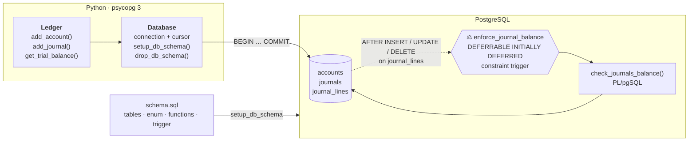
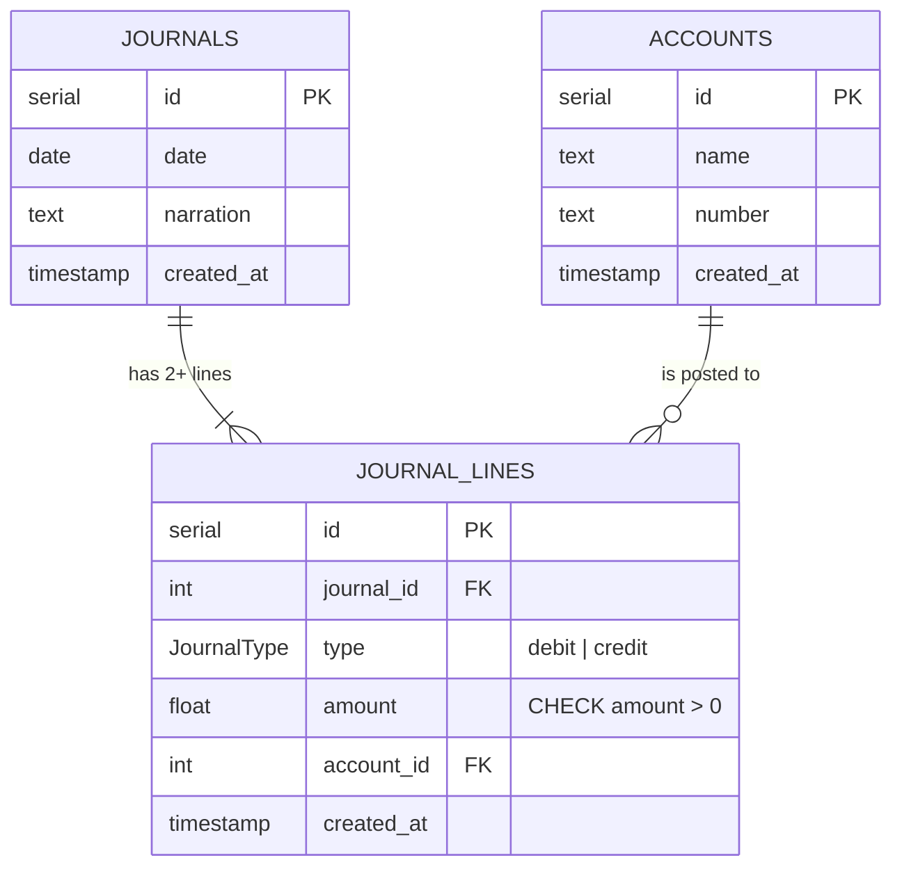
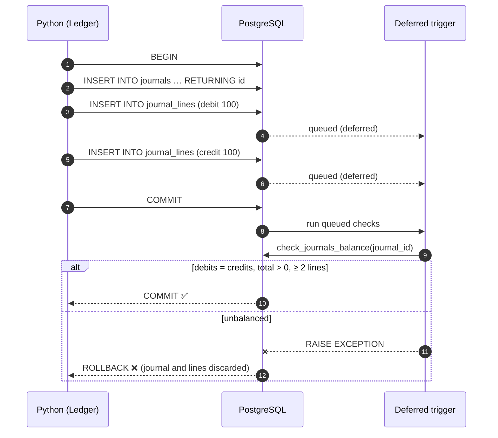

# 📒 Accounting Ledger: PostgreSQL + Python

A minimal **double-entry bookkeeping ledger** where the core accounting rule (*every journal's debits must equal its credits*) is enforced **by the database itself**, not just by application code. A deferred PostgreSQL constraint trigger rejects any unbalanced journal at commit time, so no client, script or manual `INSERT` can ever leave the books out of balance.

---

## Why it's interesting

Most ledger demos validate balances in application code, so a bug, a second client or a manual `psql` session can still corrupt the data. Here the invariant lives in PostgreSQL:

- **Deferred constraint trigger.** It checks balance once per transaction at `COMMIT`, after all lines of a journal are inserted, not after each row (where a half-written journal would always look unbalanced).
- **Atomic journals.** The journal header and its lines are written in a single transaction; if the trigger rejects it, the whole journal rolls back.
- **Database-level types.** A `JournalType` enum (`debit` / `credit`), foreign keys, and a `CHECK (amount > 0)` constraint.
- **Reporting in SQL.** The trial balance is one aggregate query over accounts and journal lines.

---

## Architecture



### Data model



### How the balance check fires



---

## Quick start

**Prerequisites:** Python 3.10+, and Docker (or any PostgreSQL 12+).

> ⚠️ `ledger.py` is a self-contained demo: on every run it executes `DROP SCHEMA public CASCADE` and recreates the schema. **Only point it at a throwaway database.**

```bash
git clone https://github.com/codemarquis/accounting-ledger-with-postgres-and-python.git
cd accounting-ledger-with-postgres-and-python

# 1. Throwaway PostgreSQL. The script connects as database "ledger", user "ledger".
docker run -d --name ledger-db -p 5432:5432 \
  -e POSTGRES_USER=ledger -e POSTGRES_PASSWORD=ledger -e POSTGRES_DB=ledger \
  postgres:16-alpine

# 2. Python dependencies
python3 -m venv .venv && source .venv/bin/activate
pip install -r requirements.txt

# 3. Run. Connection details come from the standard libpq variables.
export PGHOST=localhost PGPORT=5432 PGPASSWORD=ledger
python ledger.py
```

Expected output:

```
Trial balance:
[('100', 'Revenues', 100.0, 100.0), ('200', 'Expenses', 0.0, 0.0)]
```

### See the guard rail reject a bad journal

The bottom of `ledger.py` contains a commented-out journal that debits 101 but credits 100. Committing it fails:

```
psycopg.errors.RaiseException: Journal is not balanced or does not have at least two lines
```

The whole transaction is rolled back; neither the journal nor its lines are stored.

---

## Usage

```python
ledger = Ledger()

cash  = ledger.add_account("Cash", "1000")
sales = ledger.add_account("Sales", "4000")

ledger.add_journal(
    {"date": "2024-03-01", "narration": "Cash sale"},
    [
        {"type": "debit",  "amount": 250, "account_id": cash},
        {"type": "credit", "amount": 250, "account_id": sales},
    ],
)

for number, name, debit, credit in ledger.get_trial_balance():
    print(f"{number:>6}  {name:<10} {debit:>10.2f} {credit:>10.2f}")
```

| Method | What it does |
|---|---|
| `add_account(name, number)` | Inserts an account and returns its `id` |
| `add_journal(journal, lines)` | Inserts a journal plus its lines in **one transaction**; the deferred trigger validates the balance at commit |
| `get_trial_balance()` | Returns `(number, name, total_debit, total_credit)` for every account |
| `Database.setup_db_schema()` | Applies `schema.sql` |
| `Database.drop_db_schema()` | Drops and recreates the `public` schema (destructive) |

---

## Project structure

```
.
├── schema.sql        # tables, JournalType enum, balance function, deferred trigger
├── ledger.py         # Database + Ledger classes and a runnable demo
├── requirements.txt
└── LICENSE           # MIT
```

---

## Design notes and next steps

- **Money as `FLOAT`.** Floating point can't represent all decimal amounts exactly. A production ledger should use `NUMERIC(19,4)` (or integer minor units such as cents).
- **Configuration.** The database name and user are constants in `ledger.py`; host, port and password come from the standard `PG*` environment variables. A `DATABASE_URL` setting would make deployment easier.
- **Demo vs. library.** The demo code runs on import; moving it under `if __name__ == "__main__":` would let `Ledger` be imported safely.
- **Natural extensions:** account types (asset / liability / equity / income / expense), period closing, an immutable audit trail (no `UPDATE`/`DELETE` on posted lines), and tests that assert unbalanced journals are rejected.

---

## License

[MIT](LICENSE) © codemarquis
